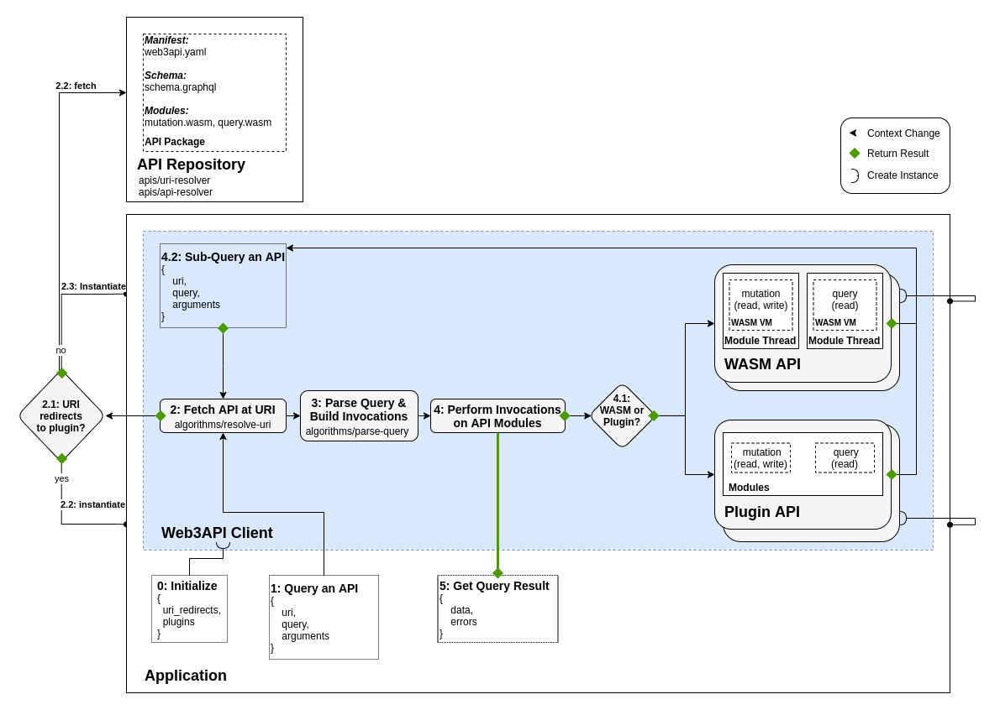

# Architecture overview
The following schema represents the overall architecture of the Web3API and how Web3API packages are used.

First, an application (dapp) should have Web3API client installed and initialized to be able to use a Web3API package.

1. Application is querying packages using a URI. This can be ENS URI i.e. `w3://ens/uniswap.eth` or IPFS hash.
All calls (both mutations and queries) to the package are done through created GraphQL API.
2. URI is resolved and package files are downloaded from API package location such as IPFS. Package is the one that defines it's schema (mutations and queries) and creates a subgraph.
3. Using query handler, queries to a package, between packages and plugins are invoked and resolved.  
With the help of plugins, packages interact with decentralized protocols such as Ethereum that implement required host methods.
The packages (WASM code) are sandboxed environments so W3 WASM module must contain all host imports including W3 helper methods for queries.
4. W3 WASM module contains package logic and is responsible for allowing the host to call query methods using W3 helper methods.
It's possible that WASM may invoke another query which is handled by the query handler again. 
Also, this part includes wrapping all the query methods and serializing data types to allow this communication.

## Components

Main components of the system can be divided into:
- [Web3API Client](../components/Web3API_Client.md) - contains exposed interfaces and methods that (d)apps can use 
- [Web3API Packages](../components/Web3API_Package.md) - contain API for interaction with decentralized protocols and apps
- [Web3API Plugins](../components/Web3API_Plugins.md) - core plugins that contain host methods that packages can use i.e. for Ethereum interactions
- [W3 WASM protocol](../components/WASM_protocol.md) - contains all host imports required for querying and invoking functions

 
